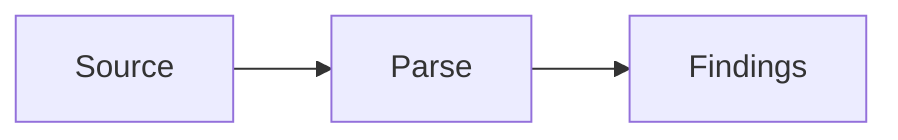

# DEV.md — Local development

How to run, build, and ship changes to the codelens documentation site.

---

## Prerequisites

| Tool | Version            |
| ---- | ------------------ |
| Node | 20.x or newer      |
| npm  | 10.x or newer      |
| git  | any modern version |

---

## First-time setup

```bash
git clone https://github.com/shubhamkaushal765/codelens-docs.git
cd codelens-docs
npm install
```

This installs Docusaurus and its peer dependencies into `node_modules/`.

---

## Day-to-day commands

```bash
# Start the dev server with hot reload at http://localhost:3000
npm run start

# Type-check (no emit) — fast sanity before commit
npm run typecheck

# Production build — writes static site to ./build
npm run build

# Preview the built site locally (after `npm run build`)
npm run serve

# Clear the Docusaurus cache (rare; if stale data appears)
npm run clear
```

---

## What "passing" means

The site has no separate test suite. The build itself is the test:

| Check                               | Enforced by                                  |
| ----------------------------------- | -------------------------------------------- |
| All internal links resolve          | `onBrokenLinks: 'throw'` in config           |
| All Markdown links resolve          | `onBrokenMarkdownLinks: 'warn'`              |
| Frontmatter + MDX compile           | `npm run build` rejects malformed pages      |
| TypeScript in `src/` and configs    | `npm run typecheck`                          |

Run both before opening a PR:

```bash
npm run typecheck && npm run build
```

---

## Common tasks

### Add a content page

1. Create `docs/<section>/<page>.md` with frontmatter (`title`, `description`).
2. Add the doc id to [sidebars.ts](../sidebars.ts) in the right category.
3. `npm run build` to verify links and frontmatter.

### Add a CLI subcommand page

1. Create `docs/cli/<subcommand>.md` following the pattern of existing pages (e.g. `docs/cli/report.md`).
2. Include: usage synopsis, arguments table, flags table, examples, and "See also" links.
3. Add the id to the `CLI reference` category in [sidebars.ts](../sidebars.ts).
4. `npm run build`.

### Add an integration page

1. Create `docs/integrations/<name>.md`.
2. Add the id to the `Integrations` category in [sidebars.ts](../sidebars.ts).
3. `npm run build`.

### Add a rule page

When a new analyzer ships in `/home/user/codelens/`:

1. Copy `/home/user/codelens/docs/rules/<RULE_ID>.md` to `docs/rules/<RULE_ID>.md` (if the file exists there) or write from scratch following the rule-page template in [DOCS.md](./DOCS.md).
2. Replace relative source-tree links (`../../crates/...`) with GitHub blob URLs (`https://github.com/shubhamkaushal765/codelens/blob/main/...`).
3. Adjust the H1 to match the frontmatter `title`.
4. Add the id to the `Rules reference` category in [sidebars.ts](../sidebars.ts).
5. `npm run build`.

### Add a Mermaid diagram

Add a `mermaid` fenced block anywhere in an MDX file:

````markdown

````

`@docusaurus/theme-mermaid` and `markdown.mermaid: true` are already configured. Run `npm run build` to validate Mermaid syntax — a parse error fails the build.

### Edit the homepage

Edit [`src/pages/index.tsx`](../src/pages/index.tsx). The homepage is a React component, not MDX.

### Change site title / URL / repo

Edit [`docusaurus.config.ts`](../docusaurus.config.ts) — top of file. Re-build.

### Update the navbar

Edit `themeConfig.navbar.items` in [`docusaurus.config.ts`](../docusaurus.config.ts).

---

## Troubleshooting

| Symptom                                            | Fix                                                   |
| -------------------------------------------------- | ----------------------------------------------------- |
| "Broken link" build error                          | The target file/anchor doesn't exist. Fix the URL.    |
| Stale content after editing                        | `npm run clear` then `npm run start` again.           |
| Type error in `docusaurus.config.ts`               | Make sure `@docusaurus/types` is up to date in deps.  |
| Code block not highlighted                         | Add the language to `prism.additionalLanguages`.      |
| Dev server won't start (port in use)               | `PORT=3001 npm run start` or stop the other process.  |

---

## Deployment

Pushing to `main` does not deploy automatically — set up the GitHub Pages workflow when ready. For now, deployment is manual:

```bash
npm run build
# Then publish ./build to the gh-pages branch:
GIT_USER=<your-username> npm run deploy
```

The `deploy` script ships with Docusaurus and pushes to `gh-pages`. Check [docusaurus.io/docs/deployment](https://docusaurus.io/docs/deployment) for variants.
