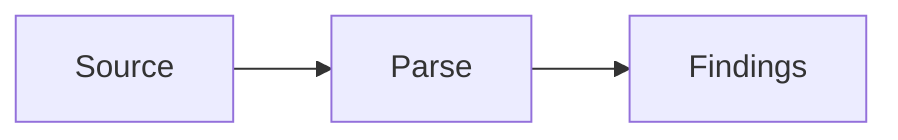

# DOCS.md — Documentation Style Guide

**Last reviewed:** 2026-05-07

How to write and maintain content for the codelens-docs site. Adapted from `/home/user/codelens/.agent/DOCS.md`.

---

## Audience

Write for **end users** of codelens — engineers, tech leads, security folks, and CI maintainers who want to scan their code and act on the results. They are not codelens contributors.

Assume readers know:

- How to use a command line.
- The general idea of a linter or static analyzer.
- How CI works at a basic level (running a step on every push / PR).

Do NOT assume readers know:

- Rust internals, Cargo workspaces, traits, or the names of the libraries codelens uses (`syn`, `oxc_parser`, `rustpython-parser`, `rayon`, `blake3`, `tower-lsp`, etc.).
- Specific complexity metrics (cyclomatic, cognitive) — define them on first use.
- Niche formats (SARIF, OSC-8 hyperlinks, JSON Schema) — explain in one line on first use.
- The internal type names or crate boundaries of `codelens`.

The two pages under `docs/extending/` are the exception — they target contributors, so trait/crate vocabulary is appropriate there.

When you introduce a term, define it on first use or link to the page that defines it.

---

## Voice

- Clear, concise, professional. No marketing copy, no exclamation marks.
- Second person (`you run`, `you configure`).
- Present tense for behavior (`codelens reports a finding`).
- Imperative for instructions (`Run`, `Open`, `Add`).
- Front-load conclusions; explain why second.
- **Lead with the user's outcome.** Open every page with what the reader can *do* with this content — not how the system is built. "Use `codelens analyze` to scan your code" beats "The `analyze` subcommand invokes `Engine::analyze_path`."
- **Tasks over internals.** Convert "X is implemented by Y" into "You can use X to ...". Mention internals only when a user must understand them (e.g. cache location, history file path).
- **Plain language over jargon.** If a term has a simpler equivalent that does not lose precision, use it. Reserve technical vocabulary (trait, crate, AST, dependency graph) for `docs/extending/` and the small "For contributors" section of `architecture.md`.

---

## Structure

1. **One H1 per file**, matching the page title in frontmatter.
2. Use H2 for top-level sections, H3 for subsections. Avoid H4+.
3. **Tables over prose** wherever a table fits.
4. Code examples only when the example *is* the rule (e.g. config snippets, CLI invocations). Examples must be copy-pasteable.
5. Lead with what; details after.
6. **Task-oriented headings** are preferred over noun-only headings on user-facing pages: "Run your first scan" beats "First scan"; "Disable a rule" beats "Per-rule config"; "Gate CI on severity" beats "Fail-on threshold". Reference tables can stay noun-only.
7. Where natural, include a **"When to use this"** mini-section near the top of CLI / integration / output pages so users can self-select.

---

## Frontmatter

Every page has frontmatter:

```yaml
---
title: Cyclomatic complexity
sidebar_label: MAINT001-cyclomatic   # only when display label differs from title
description: Detects functions whose cyclomatic complexity exceeds a threshold.
---
```

`description` powers OG tags and search snippets; keep under 160 chars.

---

## Admonitions

Use Docusaurus admonitions for callouts. Keep them short (≤2 sentences each).

| Admonition  | When                                                                  |
| ----------- | --------------------------------------------------------------------- |
| `:::tip`    | Practical advice that improves the user's experience                  |
| `:::note`   | Side information that's useful but not strictly necessary             |
| `:::caution` | Behavior likely to surprise the reader (mild)                        |
| `:::warning` | Behavior that can cause incorrect results or data loss               |
| `:::info`   | Version, scope, or status notes (e.g. "available since v1.2")        |

Example:

```markdown
:::tip
Run `codelens init` to write a default `codelens.toml` to the current directory.
:::
```

---

## Code blocks

Always specify the language for syntax highlighting:

````markdown
```rust
pub fn example() {}
```

```toml
[rules.MAINT001-cyclomatic]
threshold = 10
```

```bash
codelens analyze ./src --format json
```
````

Available Prism languages: `rust`, `python`, `toml`, `bash`, `json`, plus all defaults.

---

## Links

| Where to                              | How to write                                                            |
| ------------------------------------- | ----------------------------------------------------------------------- |
| Another doc page (same site)          | `[label](/path/to-page)` or `[label](./relative-page)`                  |
| A specific section on this site       | `[label](/path/to-page#anchor-id)`                                      |
| codelens source code on GitHub        | `[label](https://github.com/shubhamkaushal765/codelens/blob/main/...)`     |
| External standards (CWE, OWASP, etc.) | Plain URL link with descriptive label                                   |

`onBrokenLinks: 'throw'` will fail the build on any broken internal link.

---

## Rule-page template

Every page under `docs/rules/<RULE_ID>.md` follows this structure:

```markdown
---
title: <RULE_ID> — <human title>
sidebar_label: <RULE_ID>
description: <one-line summary ≤160 chars>
---

# <RULE_ID> — <human title>

| Property         | Value                                  |
| ---------------- | -------------------------------------- |
| Dimension        | <Dimension>                            |
| Default severity | <Severity>                             |
| Languages        | <list or "All">                        |
| CWE              | CWE-NNN (if applicable, else omit row) |
| OWASP            | AXX:20YY (if applicable, else omit)    |

## What it detects
…

## Why it matters
…

## Configuration
… (or "No configuration knobs beyond `enabled` and `severity`.")

## Examples — flagged
…

## Examples — not flagged
…

## Fix guidance
…

## References
- External standards (CWE, OWASP, etc.)
```

The `CWE` and `OWASP` rows in the property table are optional — include only when the rule maps to a standard. The source of truth for all mappings is [`docs/taxonomy.md`](https://github.com/shubhamkaushal765/codelens/blob/main/docs/taxonomy.md) in the codelens repo.

---

## Diagrams

Add a Mermaid diagram to a doc page only when it materially aids comprehension — a multi-step pipeline, a dependency graph, or a branching taxonomy that would be hard to parse as prose.

Rules:
- One diagram per page is usually the right amount. Do not add one per section.
- Keep node labels concise (≤ 4 words); the surrounding prose explains the detail.
- Choose `flowchart TD` for top-down processes and `flowchart LR` for left-to-right dependency graphs.
- Mermaid in MDX requires `@docusaurus/theme-mermaid` and `markdown.mermaid: true` in `docusaurus.config.ts` — both are already configured.
- Diagram fills must use hex values from the design token system. The mapping from semantic token to hex is documented in [.agent/DESIGN.md](./DESIGN.md) and [.agent/CONVENTIONS.md](./CONVENTIONS.md).

```markdown

```

---

## What NOT to write

- Internal implementation details on user-facing pages — link to the crate's `cargo doc` or to the source repo's architecture doc instead. Specifically avoid: parser library names (`syn`, `oxc_parser`, `rustpython-parser`), parallelism libraries (`rayon`), hashing libraries (`blake3`), Rust type names (`Arc<…>`, `Vec<Finding>`, `SemanticIndex`, `FunctionLike`), trait signatures, crate-graph rules, and `#[non_exhaustive]` discussions. The two `docs/extending/` pages and a short "For contributors" section in `architecture.md` are the only places this vocabulary belongs.
- Patterns that talk past the user: "This module handles…", "The Engine orchestrates…", "Phase A executes…". Rewrite as "You run X to do Y" or "When you run X, codelens does Y".
- Past-tense changelogs in page bodies — use a dedicated changelog page if needed.
- Speculation about future features — link to a GitHub issue or omit.
- Marketing copy ("powerful", "blazing-fast", "industry-leading"). State the fact.

---

## When to update

| Trigger                              | Files                                                                    |
| ------------------------------------ | ------------------------------------------------------------------------ |
| New rule ships in codelens           | `docs/rules/<RULE_ID>.md`, [sidebars.ts](../sidebars.ts)                 |
| New CLI subcommand                   | `docs/cli/<subcommand>.md`, [sidebars.ts](../sidebars.ts), `AGENTS.md` IA |
| New CLI flag on analyze              | `docs/cli/analyze.md`                                                    |
| New config knob                      | `docs/configuration/codelens-toml.md`                                    |
| New output format                    | `docs/output/<format>.md`, sidebar                                       |
| Schema bump                          | `docs/output/json-schema.md`, `docs/output/json.md`                      |
| New language                         | `docs/getting-started/install.md`, `docs/intro.md`                       |
| New integration                      | `docs/integrations/<name>.md`, [sidebars.ts](../sidebars.ts)             |

Reviewers should catch missing updates; CI does not gate on doc freshness.
