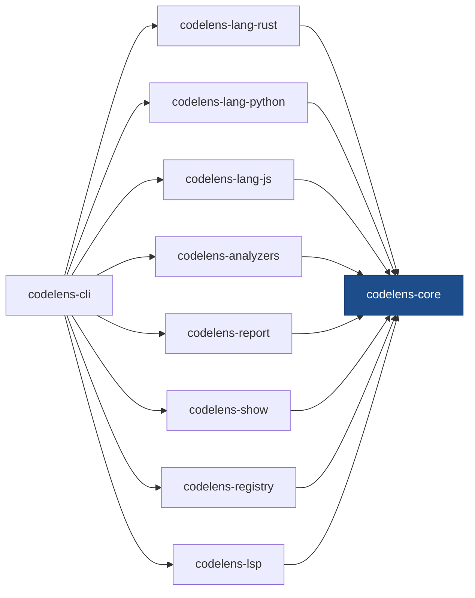
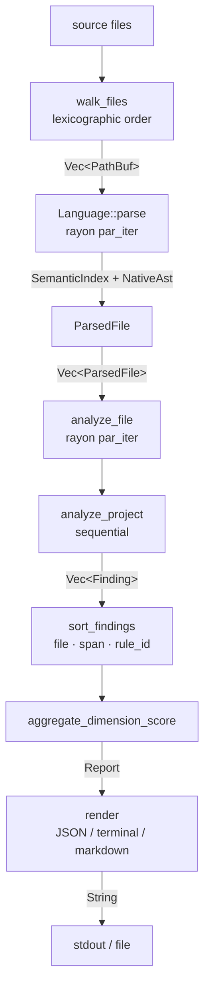

# Architecture

This page is a condensed end-user tour of the codelens architecture. The full long-form narrative lives in the source repo at [`docs/architecture.md`](https://github.com/shubhamkaushal765/codelens/blob/main/docs/architecture.md).

## Workspace crates

| Crate | Purpose |
| --- | --- |
| `codelens-core` | Traits (`Language`, `Analyzer`), types (`SemanticIndex`, `Finding`, …), `Engine` (incl. `analyze_path_cached`), `Registry`, incremental cache |
| `codelens-lang-rust` | `syn`-backed Rust frontend + Rust-only analyzers (`SEC101`) |
| `codelens-lang-python` | `rustpython-parser` Python frontend + Python-only analyzers |
| `codelens-lang-js` | `oxc_parser` JS/TS frontend; covers `.js/.mjs/.cjs/.jsx/.ts/.mts/.cts/.tsx` |
| `codelens-analyzers` | 25 cross-language analyzers spanning all five dimensions |
| `codelens-report` | JSON / SARIF 2.1.0 / Markdown / terminal formatters; A–F grade computation |
| `codelens-show` | History store (`~/.codelens/`), `tiny_http` server, embedded web UI, Unix double-fork daemon, analytics |
| `codelens-registry` | Shared `build_registry()` — used by both the CLI and the LSP |
| `codelens-lsp` | Hand-rolled stdio Language Server (JSON-RPC, no `tower-lsp`) |
| `codelens-cli` | `codelens` binary — all subcommands |

**Hard rule:** `codelens-lang-*` and `codelens-analyzers` never depend on each other. Both depend only on `codelens-core`. Only `codelens-cli` depends on every crate.

## Goals

codelens runs fast, structured static analysis across a multi-language codebase and emits findings that CI pipelines and humans can act on. The design centres on one invariant: the system must be extensible along two independent axes — new languages and new analysis dimensions — without requiring changes to the other axis.

A secondary goal is production quality: idiomatic Rust, errors via `thiserror` in library crates, `anyhow` only in the CLI, `#![warn(missing_docs)]` on every library crate, no `unwrap()` in library code.

## Non-goals

Real coverage data (line, branch, MC/DC) — coverage requires runtime instrumentation, not static analysis. Taint analysis or dataflow tracking — these need a control-flow graph. `tree-sitter` as a fallback parser — if no native Rust parser exists for a language, that language is stubbed or dropped.

## The two-axis extensibility contract

The central architectural rule, stated precisely:

> `codelens-lang-*` crates and `codelens-analyzers` must never depend on each other. Both depend only on `codelens-core`. The `codelens-cli` crate is the single integration point that depends on everything.

This is enforced at the **Cargo dependency-graph level**, not by visibility modifiers. Because `codelens-analyzers` does not list any `codelens-lang-*` crate as a dependency, the concrete `NativeAst` implementation types (e.g. `RustAst`, `PythonAst`) are simply not in scope when an analyzer is compiled. There is no `unsafe` code or `#[doc(hidden)]` trick hiding something — the types literally do not exist in that compilation unit.

The practical consequence: cross-language analyzers in `codelens-analyzers` consume **only** `SemanticIndex` fields. They never call `ParsedFile::native<T>()`. A language-specific analyzer (e.g. `SEC101-rust-unsafe`) lives inside `codelens-lang-rust` alongside the frontend and uses a typed downcast to reach the pre-extracted Rust AST data.

## Two-axis extensibility (visual)

`codelens-lang-*` and `codelens-analyzers` share the same level — neither imports the other.

## Data flow

The pipeline for a single `codelens analyze <path>` run:

## SemanticIndex

`SemanticIndex` is the load-bearing cross-language contract. Frontends fill it in at parse time; cross-language analyzers consume it. It exposes `functions`, `types`, `modules`, `imports`, `string_literals`, `comments`, and `doc_comments`. Every `FunctionLike` carries pre-computed `ComplexityMetrics` (cyclomatic, cognitive, max_nesting, returns), so analyzers like `MAINT001-cyclomatic` never re-walk a native AST — they read a `u32` from a struct field. Pre-computation also keeps non-`Send` parser fragments out of the post-parse data, allowing rayon to parallelize file analysis without extra synchronization.

## Engine and parallelism

`Engine::analyze_path` orchestrates the pipeline in three phases separated by a sequential barrier:

- **Phase A — parse (parallel):** `rayon::par_iter` over the lexicographically sorted file list. Each file is read, wrapped in `Arc<SourceFile>`, and passed to its language frontend. Parse failures are counted and do not abort the run.
- **Phase B — per-file analysis (parallel):** a second `rayon::par_iter` over the parsed files. Each worker filters analyzers by `supported_languages()` and calls `analyze_file`.
- **Phase C — project analysis (sequential):** each analyzer's `analyze_project` runs once with the full project. This is where rules that aggregate across files (fan-out, cycle detection, duplicate code) run.

A single `sort_findings` call after Phase C uses the key `(file, span.start, rule_id)`. One sort at the end is cheaper than maintaining a sorted structure during parallel collection.

## Incremental cache

`Engine::analyze_path_cached` (used by `codelens analyze` by default and always by `codelens watch`) adds a blake3 content-hash step before parse. Files whose hash matches the cache entry at `<project_root>/.codelens-cache/v1.json` reuse cached findings without re-parsing. Project-level analyzers (`CyclicDepsAnalyzer`, `TestRatioAnalyzer`, `DuplicateCodeAnalyzer`, `VulnerableDepsAnalyzer`) always re-run because they aggregate across all files. Disable with `--no-cache` or `[history] cache = false`.

## Stable contracts

- **`schema_version`** — the JSON output is at version 2. Bumped on any breaking change to the report shape. Adding fields is non-breaking; removing or retyping a field is breaking.
- **`rule_id`** — strings are stable once a rule ships. Renaming a rule ID is a breaking change to any baseline file that references it.
- **Finding sort order** — `(file, span.start, rule_id)`. Two runs against unchanged source produce byte-identical output.
- **`#[non_exhaustive]` enums** — `FunctionKind`, `Visibility`, and similar enums in `codelens-core` are non-exhaustive, so adding a variant is non-breaking; downstream code must handle a `_` arm.

:::info
The full long-form architecture doc lives at [https://github.com/shubhamkaushal765/codelens/blob/main/docs/architecture.md](https://github.com/shubhamkaushal765/codelens/blob/main/docs/architecture.md).
:::
