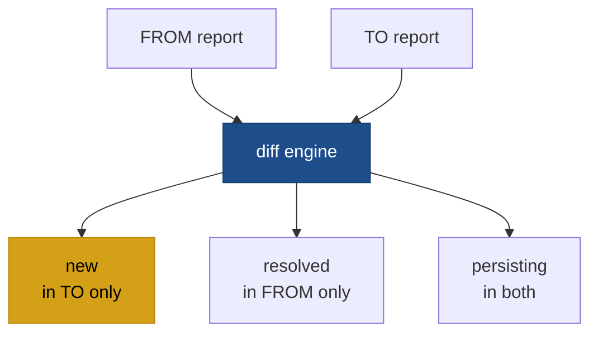

# codelens diff

```
codelens diff <FROM> <TO>
```

Use `codelens diff` to compare two analysis results and see exactly what changed: which findings are new, which were resolved, and which are still present. Both arguments can be paths to JSON report files saved with `codelens analyze --format json`, or scan IDs from your saved scan history.

## When to use this

- Review the quality impact of a pull request before merging.
- Confirm that a fix actually resolved a reported finding.
- Detect regressions between two releases or branches.



## Arguments

| Argument | Description                                              |
| -------- | -------------------------------------------------------- |
| `<FROM>` | Baseline report: path to a JSON file or a scan ID.       |
| `<TO>`   | Comparison report: path to a JSON file or a scan ID.     |

## Output

The diff groups findings into three sets:

| Set          | Meaning                                                   |
| ------------ | --------------------------------------------------------- |
| `new`        | Findings in `<TO>` but not in `<FROM>`                    |
| `resolved`   | Findings in `<FROM>` but not in `<TO>` (fixed or removed) |
| `persisting` | Findings present in both reports                          |

Two findings are considered the same if they share the same rule ID and file. Minor line-number drift (e.g. from reformatting) does not cause a finding to appear as new.

## Options

| Flag                | Default    | Description                        |
| ------------------- | ---------- | ---------------------------------- |
| `--format <FORMAT>` | `terminal` | Output format: `terminal` or `json`. |
| `-h`, `--help`      |            | Print help.                        |

## Examples

Diff two saved JSON files:

```bash
codelens diff baseline.json current.json
```

Diff two saved scans using their IDs (visible in the dashboard or `codelens show`):

```bash
codelens diff <scan-id-1> <scan-id-2>
```

## See also

- [`codelens analyze`](/cli/analyze)
- [`codelens baseline`](/cli/baseline)
- [`codelens show`](/cli/show)
