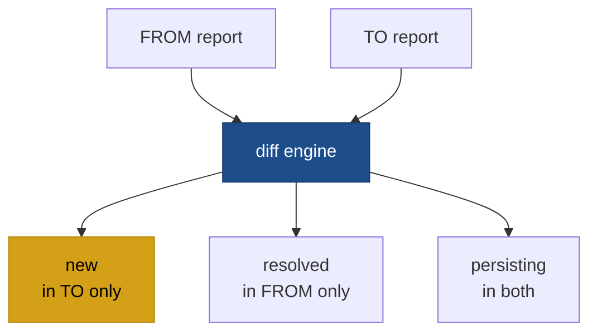

# codelens diff

```
codelens diff <FROM> <TO>
```

Compares two analysis results and prints which findings are new, resolved, or persisting. Both arguments can be paths to JSON report files or scan IDs stored in `~/.codelens/` history.



## Arguments

| Argument | Description                                              |
| -------- | -------------------------------------------------------- |
| `<FROM>` | Baseline report: path to a JSON file or a scan ID.       |
| `<TO>`   | Comparison report: path to a JSON file or a scan ID.     |

## Output

The diff groups findings into three sets:

| Set          | Meaning                                                   |
| ------------ | --------------------------------------------------------- |
| `new`        | Findings in `<TO>` but not in `<FROM>`                    |
| `resolved`   | Findings in `<FROM>` but not in `<TO>` (fixed or removed) |
| `persisting` | Findings present in both reports                          |

Two findings are considered the same if they share the same `rule_id` and `location.file`. Byte-span matching handles minor line-number drift.

## Flags

| Flag            | Default    | Description                        |
| --------------- | ---------- | ---------------------------------- |
| `--format json` | `terminal` | Output diff as JSON.               |
| `-h`, `--help`  |            | Print help.                        |

## Examples

Diff two saved JSON files:

```bash
codelens diff baseline.json current.json
```

Diff the two most-recent saved scans for a project (using scan IDs from `codelens show`):

```bash
codelens diff <scan-id-1> <scan-id-2>
```

## See also

- [`codelens analyze`](/cli/analyze)
- [`codelens baseline`](/cli/baseline)
- [`codelens show`](/cli/show)
