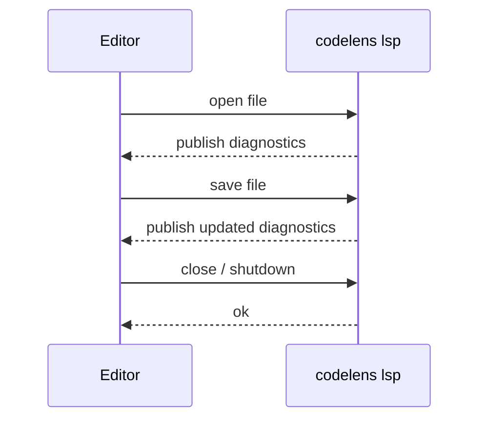

# codelens lsp

```
codelens lsp
```

Use `codelens lsp` to get codelens findings as inline diagnostics inside your editor. Once configured, your editor shows findings as warnings and errors directly in the file you are editing — no terminal required. The server re-analyzes each file when you open or save it.

## When to use this

- See findings inline while you write code, without leaving your editor.
- Get severity-colour-coded warnings (error, warning, info, hint) using your editor's standard diagnostic UI.
- Use as an alternative to `codelens watch` if your editor supports LSP.

## How it works



The server communicates over stdin/stdout using standard LSP JSON-RPC. Configure your editor to launch `codelens lsp` as the server command; the editor handles the connection automatically.

## Supported LSP messages

| Editor action           | What happens                                               |
| ----------------------- | ---------------------------------------------------------- |
| Open a file             | codelens analyzes the file and sends diagnostics.          |
| Save a file             | codelens re-analyzes the file and updates diagnostics.     |
| Edit a file             | codelens re-analyzes on each change and updates diagnostics.|
| Close the editor        | Server shuts down cleanly.                                 |

## Severity mapping

codelens severities appear in your editor using the standard diagnostic levels:

| codelens severity | Editor diagnostic level |
| ----------------- | ----------------------- |
| `critical`        | Error                   |
| `high`            | Error                   |
| `medium`          | Warning                 |
| `low`             | Information             |
| `info`            | Hint                    |

## Editor setup

### Neovim (via nvim-lspconfig)

```lua
vim.api.nvim_create_autocmd("FileType", {
  pattern = { "rust", "python", "javascript", "typescript" },
  callback = function()
    vim.lsp.start({
      name = "codelens",
      cmd = { "codelens", "lsp" },
      root_dir = vim.fs.dirname(
        vim.fs.find({ "codelens.toml", "Cargo.toml", "pyproject.toml" }, { upward = true })[1]
      ),
    })
  end,
})
```

### VS Code

Install the [codelens VS Code extension](https://marketplace.visualstudio.com/search?term=codelens&target=VSCode) if available, or configure any generic LSP client extension to launch `codelens lsp` as the server command. Point the extension at the languages you want covered (`rust`, `python`, `javascript`, `typescript`).

### Other editors

Any editor with LSP support (Helix, Emacs with `lsp-mode` or `eglot`, Sublime Text with `LSP`) can use `codelens lsp`. Set the server command to `codelens lsp` and configure it for the file types you want.

## Known limitations

- Each save triggers a full re-analysis of that file. The incremental cache used by `codelens analyze` is not active during LSP sessions.
- No code actions, no hover documentation, no workspace symbols. The server provides diagnostics only.

## See also

- [LSP integration guide](/integrations/lsp)
- [`codelens watch`](/cli/watch)
