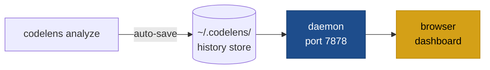

# codelens show / stop / status

Three subcommands manage the scan-history daemon:

| Command            | Effect                                                                   |
| ------------------ | ------------------------------------------------------------------------ |
| `codelens show`    | Start the daemon if not running, then open the browser.                  |
| `codelens stop`    | Stop the running daemon.                                                 |
| `codelens status`  | Print daemon state (running / stopped, PID, port).                       |



## Daemon behaviour

On Unix, `codelens show` performs a POSIX double-fork so the server outlives the terminal session. The daemon listens on a local TCP port (default `7878`). `codelens stop` sends a shutdown signal; `codelens status` reads the PID file.

:::note
The daemon is Unix-only (`cfg(unix)`). On Windows, `codelens show` runs in the foreground.
:::

## How history works

Every successful `codelens analyze` run automatically saves a scan envelope to `~/.codelens/projects/<project-hash>/scans/`. The history store keeps up to `max_scans_per_project` entries (default 100), pruning oldest on write.

To skip saving a single run:

```bash
codelens analyze . --no-save
```

To disable globally, add to `codelens.toml`:

```toml
[history]
auto_save = false
```

## Web UI tabs

The browser dashboard exposes:

| Tab       | Contents                                                              |
| --------- | --------------------------------------------------------------------- |
| Overview  | Latest scores, grade summary, delta vs. previous scan                 |
| Scans     | List of saved scans; delete or label a scan                           |
| Findings  | Paginated findings for a selected scan; filter by dimension/severity  |
| Trends    | Per-dimension score time-series                                        |
| Diff      | Finding-level diff between any two scans (new / resolved / persisting)|
| Heatmap   | Per-file rollup of findings across all scans                          |
| Config    | TOML snapshot stored with each scan                                   |

## HTTP API

All analytics are derived server-side from the saved scan envelopes.

| Method · Path | Returns |
| --- | --- |
| `GET /api/healthz` | `{ok, version}` |
| `GET /api/projects` | list of projects with `{hash, name, root, last_scan_at, scan_count, latest_scores}` |
| `GET /api/projects/:hash` | project meta + scans index |
| `GET /api/projects/:hash/scans` | scans index only |
| `GET /api/projects/:hash/scans/:id` | full scan envelope (report, config_hash, captured_at) |
| `GET /api/projects/:hash/scans/:id/analytics` | severity / dimension / rule / file counts, CWE/OWASP rollups, A–F grades |
| `GET /api/projects/:hash/summary` | latest analytics + delta-vs-previous + parse-failure totals |
| `GET /api/projects/:hash/diff?from=&to=` | finding-level diff: `new`, `resolved`, `persisting` |
| `GET /api/projects/:hash/trends` | per-scan time-series for plotting |
| `GET /api/projects/:hash/heatmap` | per-file rollups across all scans |
| `GET /api/projects/:hash/configs/:cfg` | TOML snapshot |
| `DELETE /api/projects/:hash/scans/:id` | delete a scan (idempotent) |
| `PUT /api/projects/:hash/scans/:id/label` | set / clear a free-form scan label |

## Configuration

| Field                            | Default | Description                                       |
| -------------------------------- | ------- | ------------------------------------------------- |
| `history.auto_save`              | `true`  | When false, scans are never written.              |
| `history.max_scans_per_project`  | `100`   | Older scans are pruned on write when exceeded.    |
| `history.cache`                  | `true`  | Enable the incremental file-hash cache.           |

## See also

- [`codelens diff`](/cli/diff)
- [Baselines and fail-on](/configuration/baselines-and-fail-on)
