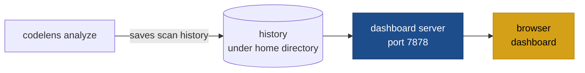

# codelens show / stop / status

Use `codelens show` to open a local browser dashboard where you can explore your scan history, track quality trends over time, and compare findings across runs.

Three subcommands manage the dashboard:

| Command            | Effect                                                                   |
| ------------------ | ------------------------------------------------------------------------ |
| `codelens show`    | Start the dashboard server (if not already running) and open the browser.|
| `codelens stop`    | Stop the running dashboard server.                                        |
| `codelens status`  | Show whether the server is running, and on which port.                   |



## How history works

Every `codelens analyze` run automatically saves its results to history under your home directory. The dashboard reads from this history to populate all tabs and charts. By default, up to 100 scans are kept per project; older scans are removed when that limit is reached.

To skip saving a single run:

```bash
codelens analyze . --no-save
```

To disable saving globally, add to `codelens.toml`:

```toml
[history]
auto_save = false
```

## Dashboard tabs

| Tab       | What you see                                                          |
| --------- | --------------------------------------------------------------------- |
| Overview  | Latest scores, grade summary, and change since the previous scan      |
| Scans     | All saved scans; delete or label any scan                             |
| Findings  | Findings for a selected scan, filterable by dimension and severity    |
| Trends    | Score history per dimension over time                                 |
| Diff      | Finding-level comparison between any two scans                        |
| Heatmap   | Per-file finding counts across all scans                              |
| Config    | The configuration snapshot recorded with each scan                    |

## HTTP API

The dashboard server also exposes a JSON API if you want to build your own tooling on top of the scan history.

| Method · Path | Returns |
| --- | --- |
| `GET /api/healthz` | `{ok, version}` |
| `GET /api/projects` | List of projects with latest scores and scan count |
| `GET /api/projects/:hash` | Project metadata and scans index |
| `GET /api/projects/:hash/scans` | Scans index |
| `GET /api/projects/:hash/scans/:id` | Full scan result |
| `GET /api/projects/:hash/scans/:id/analytics` | Finding counts by severity, dimension, rule, and file |
| `GET /api/projects/:hash/summary` | Latest analytics plus delta vs. previous scan |
| `GET /api/projects/:hash/diff?from=&to=` | Finding diff: new, resolved, and persisting |
| `GET /api/projects/:hash/trends` | Per-scan time-series data |
| `GET /api/projects/:hash/heatmap` | Per-file finding rollups |
| `GET /api/projects/:hash/configs/:cfg` | Configuration snapshot |
| `DELETE /api/projects/:hash/scans/:id` | Delete a scan |
| `PUT /api/projects/:hash/scans/:id/label` | Set or clear a label on a scan |

## Configuration

| Field                            | Default | Description                                       |
| -------------------------------- | ------- | ------------------------------------------------- |
| `history.auto_save`              | `true`  | Set to `false` to stop saving scans automatically.|
| `history.max_scans_per_project`  | `100`   | Older scans are removed when this limit is reached.|
| `history.cache`                  | `true`  | Enable the incremental file cache between runs.   |

:::note
On Unix, the dashboard server runs in the background and outlives your terminal session. On Windows, it runs in the foreground.
:::

## See also

- [`codelens diff`](/cli/diff)
- [Baselines and fail-on](/configuration/baselines-and-fail-on)
