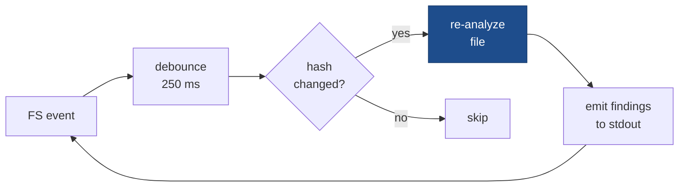

# codelens watch

```
codelens watch [PATH]
```

Watches `<PATH>` for file-system changes and re-runs `codelens analyze` automatically. Uses the incremental file-hash cache unconditionally, so only changed files are re-analysed. Runs until you press Ctrl-C.



## Arguments

| Argument | Description                                         |
| -------- | --------------------------------------------------- |
| `[PATH]` | Root path to watch. Defaults to `.`.                |

## Behaviour

- Uses the [`notify`](https://crates.io/crates/notify) crate for cross-platform filesystem events.
- Changes are **debounced** by 250 ms to coalesce rapid saves (e.g. editor auto-save storms).
- The incremental cache at `<project_root>/.codelens-cache/v1.json` is always active; only files whose blake3 content hash changed since the last run are re-parsed and re-analysed.
- Output is printed to stdout after each triggered run; terminal format is used by default.

## Flags

| Flag            | Default | Description                                        |
| --------------- | ------- | -------------------------------------------------- |
| `--format`      | `terminal` | Output format for each triggered run.           |
| `-h`, `--help`  |         | Print help.                                        |

## Example

```bash
codelens watch ./src
```

## See also

- [`codelens analyze`](/cli/analyze)
- [`codelens lsp`](/cli/lsp)
