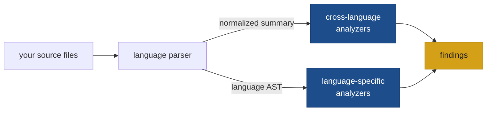

# Analyzers and findings

## Findings

A *finding* is a single problem codelens detected in your code. Every finding has a rule ID (like `SEC001-hardcoded-secret`), a severity, a dimension, and a precise location in your source files.

When you run `codelens analyze`, the output is a list of findings. Here is what one looks like in JSON:

```json
{
  "analyzer": "MAINT001-cyclomatic",
  "dimension": "maintainability",
  "rule_id": "MAINT001-cyclomatic",
  "severity": "medium",
  "message": "function `process_request` has cyclomatic complexity 14 (threshold 10)",
  "location": {
    "file": "src/lib.rs",
    "span": { "start": 812, "end": 1547 },
    "start": { "line": 42, "column": 1 },
    "end": { "line": 78, "column": 2 }
  },
  "suggestion": "Extract sub-routines to reduce branching.",
  "references": ["https://docs.codelens.dev/rules/MAINT001-cyclomatic"],
  "cwe": ["CWE-1121"],
  "owasp": []
}
```

Every finding carries these fields:

| Field        | What it contains                                                                  |
| ------------ | --------------------------------------------------------------------------------- |
| `rule_id`    | Stable identifier for the rule that fired, e.g. `MAINT001-cyclomatic`            |
| `dimension`  | Which of the five dimensions this finding belongs to                              |
| `severity`   | How serious the problem is: `info`, `low`, `medium`, `high`, or `critical`        |
| `message`    | A plain-language description of what was found                                    |
| `location`   | File path and the exact line and column range where the problem occurs            |
| `suggestion` | A concrete fix hint (present on most security and documentation rules)            |
| `references` | Links to the rule page and any relevant external standards                        |
| `cwe`        | CWE identifiers where applicable, e.g. `"CWE-798"` for hardcoded credentials     |
| `owasp`      | OWASP category where applicable, e.g. `"A07:2021"`                               |

The `rule_id` is stable — it will not change between codelens releases, so you can safely reference it in baseline files, ignore lists, and CI configuration.

The full JSON schema is documented at [JSON schema](/output/json-schema).

:::note
Findings are sorted by file path, then by position in the file, then by rule ID. Two runs against unchanged source produce byte-identical output.
:::

## Analyzers

An *analyzer* is a check codelens runs against your code. Each one looks for one kind of problem and emits zero or more findings per file. Most analyzers map directly to a single rule ID, though a few closely related rules share one analyzer.

codelens runs two kinds of analyzers:

- **Cross-language analyzers** work across Rust, Python, and JavaScript/TypeScript. They read the normalized information codelens extracts from every file — function shapes, import lists, comments, and so on — without needing to understand language-specific syntax.
- **Language-specific analyzers** go deeper into a single language's syntax. For example, [`SEC101-rust-unsafe`](/rules/SEC101-rust-unsafe) inspects Rust source directly to find `unsafe` blocks; that check only makes sense for Rust and runs only on Rust files.



From a user perspective, you do not need to distinguish between the two kinds. codelens selects the right analyzers for each file automatically based on the file's language.

To write a new analyzer, see [Add an analyzer](/extending/add-an-analyzer).
