# Dimensions

A *dimension* is a category of code-quality concern. codelens has five built-in dimensions; each finding is assigned to exactly one. Scores are computed per dimension, so CI gates can target one concern at a time.

## Reference

| Dimension       | What it measures                                                          | Example rules                                                                                                                      |
| --------------- | ------------------------------------------------------------------------- | ---------------------------------------------------------------------------------------------------------------------------------- |
| Maintainability | How easy the code is to read and modify (length, nesting, branching)      | [MAINT001-cyclomatic](/rules/MAINT001-cyclomatic), [MAINT003-fn-length](/rules/MAINT003-fn-length), [MAINT004-file-length](/rules/MAINT004-file-length), [MAINT005-deep-nesting](/rules/MAINT005-deep-nesting) |
| Security        | Patterns commonly exploited by attackers                                  | [SEC001-hardcoded-secret](/rules/SEC001-hardcoded-secret), [SEC002-eval-sink](/rules/SEC002-eval-sink), [SEC101-rust-unsafe](/rules/SEC101-rust-unsafe) |
| Complexity      | Structural complexity beyond per-function metrics (fan-out, cyclic deps, duplicate code) | CPLX001-fan-out, CPLX002-cyclic-deps, CPLX003-duplicate-code |
| Documentation   | Public-API doc coverage and inline TODO/FIXME inventory                   | [DOC001-public-api-undoc](/rules/DOC001-public-api-undoc), [DOC002-todo-fixme](/rules/DOC002-todo-fixme) |
| Test smell      | Quality of tests themselves (test ratio, no-assert tests, skipped tests, flaky patterns) | TEST001-test-ratio, TEST002-no-asserts, TEST003-skipped, TEST004-flaky-time, TEST005-assert-count |

:::note
Each dimension produces an independent 0–100 score. There is no single composite score — you can choose which dimensions to gate on.
:::

All 25 rules across all five dimensions ship and run by default. Browse the full list under [Rules reference](/rules/).

For the score formula, see [Severity and scoring](/concepts/severity-and-scoring).

## Dimensions and rules (overview)

```mermaid
flowchart TD
    CL[codelens]

    CL --> MAINT[Maintainability]
    CL --> SEC[Security]
    CL --> CPLX[Complexity]
    CL --> DOC[Documentation]
    CL --> TEST[Test smell]

    MAINT --> M1[MAINT001-cyclomatic]
    MAINT --> M2[MAINT003-fn-length]
    MAINT --> M3[MAINT004-file-length]
    MAINT --> M4[MAINT005-deep-nesting]

    SEC --> S1[SEC001-hardcoded-secret]
    SEC --> S2[SEC002-eval-sink]
    SEC --> S3[SEC101-rust-unsafe]

    CPLX --> C1[CPLX001-fan-out]
    CPLX --> C2[CPLX002-cyclic-deps]
    CPLX --> C3[CPLX003-duplicate-code]

    DOC --> D1[DOC001-public-api-undoc]
    DOC --> D2[DOC002-todo-fixme]

    TEST --> T1[TEST001-test-ratio]
    TEST --> T2[TEST002-no-asserts]
    TEST --> T3[TEST003-skipped]
```

