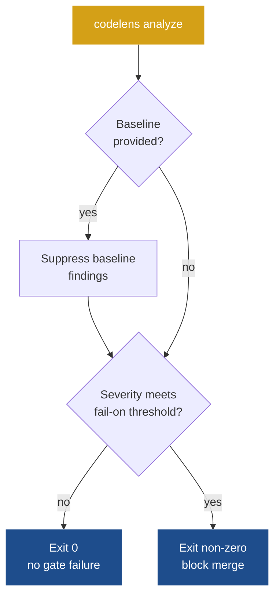

# Baselines and fail-on

Two flags give you precise control over how codelens gates your CI pipeline:

- **`--fail-on`** — exit non-zero when any finding reaches a given severity level. Use this to block merges on serious issues.
- **`--baseline`** — suppress findings that were already present in a known-good run. Use this to adopt codelens on a codebase that already has issues without being swamped by pre-existing noise.



## `--fail-on`

Without `--fail-on`, `codelens analyze` always exits `0` — useful for informational runs, but not for blocking merges.

Add `--fail-on` to fail CI whenever a finding reaches or exceeds the severity you specify:

```bash
codelens analyze . --fail-on high
```

| Value      | Fails when a finding is…    |
| ---------- | --------------------------- |
| `info`     | Info or above (any finding) |
| `low`      | Low or above                |
| `medium`   | Medium or above             |
| `high`     | High or above               |
| `critical` | Critical only               |

Default: unset — no threshold, always exits `0`.

### GitHub Actions example

```yaml
name: codelens

on: [pull_request]

jobs:
  analyze:
    runs-on: ubuntu-latest
    permissions:
      security-events: write
    steps:
      - uses: actions/checkout@v4
      - uses: shubhamkaushal765/codelens@main
        with:
          path: "."
          fail-on: "high"
```

See [GitHub Action](/integrations/github-action) for the full input reference.

## `--baseline`

A baseline file records every finding from a run on your main branch (or any chosen reference point). On subsequent runs, findings that match the baseline are suppressed — only **new** findings reach the formatter and `--fail-on`. This lets you adopt codelens on a codebase that already has issues without failing CI on things you haven't fixed yet.

### Set up a baseline in three steps

**Step 1.** Capture today's findings:

```bash
codelens baseline save -o codelens-baseline.json
```

**Step 2.** Commit the baseline file so CI can use it:

```bash
git add codelens-baseline.json
git commit -m "chore: codelens baseline"
```

**Step 3.** Update your CI command to apply the baseline:

```bash
codelens analyze . --baseline codelens-baseline.json --fail-on high
```

From this point on, pre-existing findings are silenced. Any new finding at `high` or above fails CI.

### Capture a baseline from a historical git ref

```bash
codelens baseline save --ref v1.0.0 -o baseline-v1.0.0.json
```

See [`codelens baseline`](/cli/baseline) for the full reference.

:::tip
Refresh the baseline periodically as legacy findings get fixed. Use `codelens diff` to compare two saved reports and track your progress over time.
:::

## Cache and baseline interaction

The incremental cache (`--no-cache` / `[history] cache = false`) affects analysis speed but not baseline suppression. Baseline matching is applied after all findings are collected, regardless of whether the cache was used.

## See also

- [`codelens analyze` reference](/cli/analyze)
- [`codelens baseline`](/cli/baseline)
- [`codelens diff`](/cli/diff)
- [`codelens.toml` reference](/configuration/codelens-toml)
- [Per-rule configuration](/configuration/per-rule-config)
