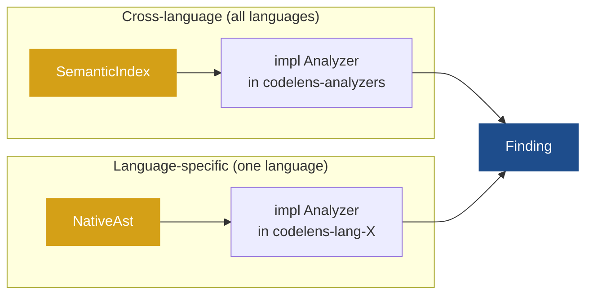

# Add an analyzer

You want codelens to detect something new. This guide covers both kinds of analyzer you can write:

- **Cross-language rule** — works across all languages by reading the normalized `SemanticIndex`. Lives in `codelens-analyzers`. No changes to any language crate needed.
- **Language-specific rule** — needs access to the native AST for one language. Lives inside the relevant `codelens-lang-X` crate.

Adding either type of analyzer never requires changes to the other.



---

## Cross-language rule

Use this path when your rule can be expressed in terms of functions, types, imports, string literals, or doc comments — the data that every language frontend writes into the `SemanticIndex`.

### Step 1 — Implement `Analyzer`

Create `crates/codelens-analyzers/src/my_rule.rs`. The `analyze_file` method receives a `&ParsedFile` and should call `file.index()` to read the `SemanticIndex`. Never call `file.native::<T>()` in a cross-language rule — that would tie it to one language.

The shape to follow (modeled on [`cyclomatic.rs`](https://github.com/shubhamkaushal765/codelens/blob/main/crates/codelens-analyzers/src/cyclomatic.rs)). The `id` appears in reports and config; `dimension` controls which section of the report the finding lands in; `analyze_file` is called once per file and returns zero or more findings:

```rust
pub struct MyRuleAnalyzer;

impl Analyzer for MyRuleAnalyzer {
    fn id(&self) -> AnalyzerId { AnalyzerId::new("my-rule") }
    fn dimension(&self) -> Dimension { Dimension::Maintainability }
    fn supported_languages(&self) -> SupportedLanguages { SupportedLanguages::All }
    fn rules(&self) -> &[RuleMeta] { &[/* ... */] }
    fn analyze_file(&self, ctx: &AnalysisContext<'_>, file: &ParsedFile) -> Vec<Finding> {
        file.index().functions.iter()
            .filter(|f| /* your condition */)
            .map(|f| Finding { /* ... */ })
            .collect()
    }
}
```

`SupportedLanguages::All` means the rule runs on every language codelens knows about, including any languages added in the future. You can restrict to a subset with `SupportedLanguages::Only(&[LanguageId("rust"), LanguageId("python")])` without importing any language crate.

### Step 2 — Register in `builtin()`

Add your analyzer to the list in [`codelens-analyzers/src/lib.rs`](https://github.com/shubhamkaushal765/codelens/blob/main/crates/codelens-analyzers/src/lib.rs). This is the only other file you need to touch — the `build_registry()` function in `codelens-registry` calls `builtin()`, so your rule is picked up automatically by both the CLI and the LSP:

```rust
pub fn builtin() -> Vec<Box<dyn Analyzer>> {
    vec![
        Box::new(CyclomaticAnalyzer),
        Box::new(PublicApiUndocAnalyzer),
        Box::new(HardcodedSecretAnalyzer),
        Box::new(MyRuleAnalyzer),   // add here
    ]
}
```

### Step 3 — Assign a `rule_id`

Use the format `<DIM><NNN>-slug`, for example `MAINT002-fan-out`. Choose the prefix that matches your rule's dimension:

| Prefix  | Dimension       |
| ------- | --------------- |
| `MAINT` | Maintainability |
| `SEC`   | Security        |
| `CMPLX` | Complexity      |
| `DOC`   | Documentation   |
| `TEST`  | TestSmell       |

### Step 4 — Document the rule

Create `docs/rules/<rule_id>.md` in the codelens-docs repo. Include: what the rule detects, why it matters, how to fix it, a positive fixture (triggers the finding), a negative fixture (does not trigger), and any config knobs. See existing pages under [Rules reference](/rules/) for the expected structure.

### Step 5 — Add fixtures and tests

Add fixture files under `fixtures/<language>/` — one that triggers the finding and one that does not — then verify everything passes:

```bash
cargo build --workspace && cargo test --workspace
```

---

## Language-specific rule

Use this path when your rule needs access to AST nodes that aren't captured in the `SemanticIndex` — for example, Rust `unsafe` blocks, Python decorator chains, or JS prototype manipulation.

### Step 1 — Implement `Analyzer` against the native AST

Create `crates/codelens-lang-X/src/analyzers/my_rule.rs`. Use the typed accessor for the language's native AST (e.g. `try_rust_ast`, `try_python_ast`) rather than downcasting manually. The early-return on a missing AST ensures codelens safely skips files that aren't the expected language without any error:

```rust
pub struct MyLangRuleAnalyzer;

impl Analyzer for MyLangRuleAnalyzer {
    fn analyze_file(&self, _ctx: &AnalysisContext<'_>, file: &ParsedFile) -> Vec<Finding> {
        let Some(ast) = try_x_ast(file) else { return vec![] };
        // use ast fields to produce findings
        todo!()
    }
    // implement id(), dimension(), supported_languages(), rules() ...
}
```

See [`unsafe_block.rs`](https://github.com/shubhamkaushal765/codelens/blob/main/crates/codelens-lang-rust/src/analyzers/unsafe_block.rs) for a complete, working example.

### Step 2 — Register in the language crate

Add your analyzer inside the language crate's `register()` function (see [Step 7 in Add a language frontend](/extending/add-a-language)). It is picked up automatically from there — no changes to `codelens-analyzers` or `codelens-registry` are needed.

### Step 3 — Assign a `rule_id`

Follow the same `<DIM><NNN>-slug` format. For language-specific rules, conventionally append the language tag: `SEC101-rust-unsafe`, `SEC002-python-eval-sink`.

### Step 4 — Document the rule

Write `docs/rules/<rule_id>.md` with positive and negative fixture examples for the target language.

---

## Verify your work

```bash
cargo build --workspace && cargo test --workspace
```
