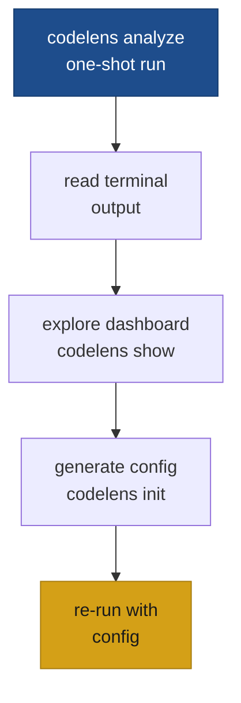

# Your first analysis

This walkthrough takes you from zero to a configured codelens project in five steps. If you haven't installed codelens yet, start at [Install](/getting-started/install).



## Run your first scan

Point `codelens analyze` at any directory. No configuration file is required.

```bash
codelens analyze ./src
```

codelens scans every Rust, Python, and JavaScript/TypeScript file it finds, respecting `.gitignore` and skipping common vendor directories automatically. Results appear in the terminal as soon as the scan finishes.

## Read the results

The terminal report lists findings grouped by dimension and severity, then closes with a scoreboard — one 0–100 score and an A–F grade per dimension:

```text
Maintainability  87.4  B
Security         98.1  A
Complexity      100.0  A
Documentation    73.5  C
TestSmell        91.0  A
```

See [Reading the output](/getting-started/reading-output) for a full walkthrough of what each part means.

## Explore the dashboard

After a scan, open the interactive history dashboard:

```bash
codelens show
```

This starts a local HTTP server and opens a browser tab with Overview, Scans, Findings, Trends, Diff, Heatmap, and Config tabs. Every `codelens analyze` run is saved automatically so the Trends and Diff views fill in over time.

To run a one-off scan without saving it to history:

```bash
codelens analyze ./src --no-save
```

## Generate a config file

Once you know which rules and thresholds matter for your project, generate a `codelens.toml` starter file:

```bash
codelens init
```

This writes `codelens.toml` to the current directory with commented sections for general settings, per-dimension thresholds, and per-rule overrides. Edit the file to match your project's standards. See the [codelens.toml reference](/configuration/codelens-toml) for every available field.

## Re-run with your config

When `codelens.toml` is present at the project root, codelens picks it up automatically — just run from the root:

```bash
codelens analyze .
```

To point at a config file in a non-standard location:

```bash
codelens analyze ./src --config ./codelens.toml
```

For the complete list of flags, see [`codelens analyze`](/cli/analyze).
