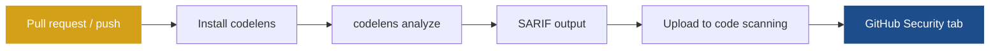

# GitHub Action

Add codelens to GitHub Actions to scan every PR and post findings to GitHub code scanning. The action installs codelens, scans your code, and uploads findings as a SARIF report — which then appears in the **Security** tab and as inline annotations on pull requests.

## Complete workflow

Copy this into `.github/workflows/codelens.yml`:

```yaml
name: codelens

on:
  push:
    branches: [main]
  pull_request:

jobs:
  codelens:
    runs-on: ubuntu-latest
    permissions:
      security-events: write
    steps:
      - uses: actions/checkout@v4
      - uses: shubhamkaushal765/codelens@main
        with:
          path: "."
          fail-on: "medium"
```

The `security-events: write` permission is required so the action can upload the SARIF report to GitHub.

## Inputs

| Input     | Required | Default  | Description                                                                       |
| --------- | -------- | -------- | --------------------------------------------------------------------------------- |
| `path`    | no       | `.`      | Root path to scan, relative to the repository root.                               |
| `format`  | no       | `sarif`  | Output format. Use `sarif` to upload to code scanning, or `json` for an artifact. |
| `fail-on` | no       | `medium` | Fail the job when findings at this severity or higher are found.                  |
| `version` | no       | `latest` | Version of codelens to install (`latest` or a semver string such as `0.1.0`).    |

## How findings reach GitHub



After the action runs, findings appear both in the repository's **Security > Code scanning** tab and as inline annotations on the pull request diff.

## Common recipes

### Gate on severity

Fail the job only for high-severity and above, but still upload all findings to code scanning:

```yaml
- uses: shubhamkaushal765/codelens@main
  with:
    fail-on: "high"
```

### Save a JSON report as an artifact instead of uploading to code scanning

Set `format: json` to write a JSON report file and skip the SARIF upload:

```yaml
- uses: shubhamkaushal765/codelens@main
  with:
    path: "."
    format: "json"
    fail-on: "high"
- uses: actions/upload-artifact@v4
  with:
    name: codelens-report
    path: codelens-results.json
```

### Pin a specific version

Pin to a known codelens version to avoid unexpected changes when new rules are released:

```yaml
- uses: shubhamkaushal765/codelens@main
  with:
    version: "0.1.0"
    fail-on: "high"
```

## See also

- [`codelens analyze`](/cli/analyze)
- [Baselines and fail-on](/configuration/baselines-and-fail-on)
- [SARIF output](/output/sarif)
