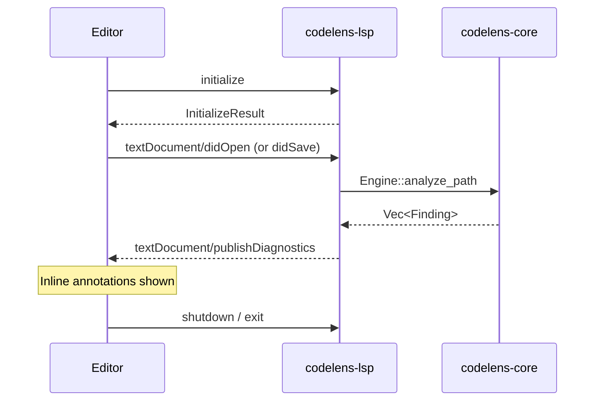

# LSP integration

`codelens lsp` starts a stdio JSON-RPC Language Server. Editors that support the Language Server Protocol receive inline diagnostics for Rust, Python, and JavaScript/TypeScript files.

## How it works



When a file is opened or saved, the LSP server runs `Engine::analyze_path` against that file and publishes diagnostics via `textDocument/publishDiagnostics`. Findings appear as inline annotations in your editor.

## Severity mapping

| codelens severity | LSP severity    | Typical editor display       |
| ----------------- | --------------- | ----------------------------- |
| `critical`        | Error (1)       | Red underline / error icon    |
| `high`            | Error (1)       | Red underline / error icon    |
| `medium`          | Warning (2)     | Yellow underline / warning    |
| `low`             | Information (3) | Blue underline / info         |
| `info`            | Hint (4)        | Dotted underline / hint       |

## Supported LSP messages

| Message                    | Support |
| -------------------------- | ------- |
| `initialize`               | Yes     |
| `initialized`              | Yes     |
| `textDocument/didOpen`     | Yes     |
| `textDocument/didSave`     | Yes     |
| `textDocument/didChange`   | Yes     |
| `shutdown` / `exit`        | Yes     |
| Code actions               | No      |
| Hover                      | No      |
| Workspace symbols          | No      |

## Editor setup

### Neovim

Using the built-in `vim.lsp.start`:

```lua
vim.api.nvim_create_autocmd("FileType", {
  pattern = { "rust", "python", "javascript", "typescript", "javascriptreact", "typescriptreact" },
  callback = function()
    vim.lsp.start({
      name = "codelens",
      cmd = { "codelens", "lsp" },
      root_dir = vim.fs.dirname(
        vim.fs.find(
          { "codelens.toml", "Cargo.toml", "pyproject.toml", "package.json" },
          { upward = true }
        )[1]
      ),
    })
  end,
})
```

### Emacs (eglot)

```elisp
(add-to-list 'eglot-server-programs
  '((rust-mode python-mode js-mode typescript-mode)
    "codelens" "lsp"))
```

Then run `M-x eglot` in a supported buffer.

### Helix

Add to `~/.config/helix/languages.toml`:

```toml
[[language]]
name = "rust"
language-servers = ["codelens-lsp"]

[language-server.codelens-lsp]
command = "codelens"
args = ["lsp"]
```

Repeat the `[[language]]` block for `python`, `javascript`, and `typescript`.

## Known limitations

- Each save triggers a full re-analysis of the file; the incremental cache is not used in LSP mode.
- No incremental parsing, no code actions, no hover documentation.

## See also

- [`codelens lsp` reference](/cli/lsp)
- [`codelens watch`](/cli/watch)
