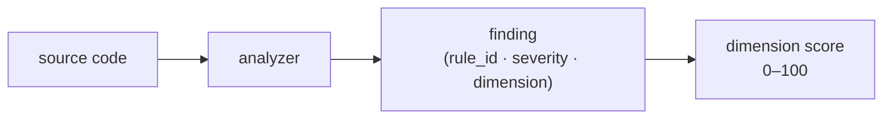

import PipelineDiagram from '@site/src/components/diagrams/PipelineDiagram';

# Introduction

codelens scans your source code and tells you what's wrong across five quality dimensions: security, maintainability, complexity, documentation, and test quality. Run it locally to catch issues before you commit, in CI to gate on quality scores, or in your editor to see findings inline as you type.

<PipelineDiagram />

## What you can do with codelens

- **Catch security issues early.** codelens flags hardcoded secrets, unsafe patterns, and common vulnerability classes (CWE/OWASP labeled) before they reach production.
- **Gate CI on code quality.** Fail a build if the security score drops below 95 while letting documentation slip — each dimension has its own 0–100 score that you can threshold independently.
- **Track trends over time.** Every scan is saved locally. Run `codelens show` to open a dashboard with Trends, Diff, and Heatmap views so you can see whether quality is improving sprint-over-sprint.
- **Get inline diagnostics in your editor.** `codelens lsp` integrates with any LSP-compatible editor and surfaces findings as you save files.

## Five quality dimensions

Instead of a flat list of warnings, codelens groups every finding into one of five named dimensions and gives each an independent score:

| Dimension       | What it measures                                          |
| --------------- | --------------------------------------------------------- |
| Security        | Patterns commonly exploited by attackers                  |
| Maintainability | How easy the code is to read and change                   |
| Complexity      | Project-level structural complexity (fan-out, cycles)     |
| Documentation   | Public-API doc coverage and TODO/FIXME inventory          |
| TestSmell       | Quality of the tests themselves                           |

This means you can tell CI "fail on security, warn on documentation" without hand-curating severities. See [Dimensions](/concepts/dimensions) for the full rule list and [Severity and scoring](/concepts/severity-and-scoring) for how scores are calculated.

## Languages supported

| Language                | Status | Notes                                                  |
| ----------------------- | ------ | ------------------------------------------------------ |
| Rust                    | Full   | Built-in                                               |
| Python                  | Full   | Built-in                                               |
| JavaScript / TypeScript | Full   | Built-in; covers `.js`, `.mjs`, `.cjs`, `.jsx`, `.ts`, `.mts`, `.cts`, `.tsx` |
| Go                      | Stub   | Not yet supported                                      |

For installation details and the full language matrix, see [Install](/getting-started/install#language-support).

## Rules

25 rules span all five dimensions. Rule IDs use a dimension prefix: `MAINT`, `SEC`, `CPLX`, `DOC`, `TEST`. Findings that map to industry vulnerability taxonomies carry CWE and OWASP labels — filter with `--cwe` or `--owasp`. Browse the full list under [Rules reference](/rules/).

## Output formats

codelens prints a colored terminal report by default. Use `--format json` for machine-readable output, `--format markdown` for PR comments, or `--format sarif` for GitHub code-scanning integration. See [Terminal output](/output/terminal).

## Dashboard and scan history

Run `codelens show` after any scan to open a local browser dashboard with Overview, Scans, Findings, Trends, Diff, Heatmap, and Config tabs. See [`codelens show`](/cli/show).

## Editor integration

`codelens lsp` starts a Language Server that sends findings to your editor whenever you save a file. See [LSP integration](/integrations/lsp).

## GitHub Action

A ready-made GitHub Action installs codelens, runs analysis, and uploads results to GitHub code scanning in one step. See [GitHub Action](/integrations/github-action).

## Extending codelens

You can add support for new languages or write custom analyzers without touching the rest of the codebase. See [Add a language frontend](/extending/add-a-language) and [Add an analyzer](/extending/add-an-analyzer).
